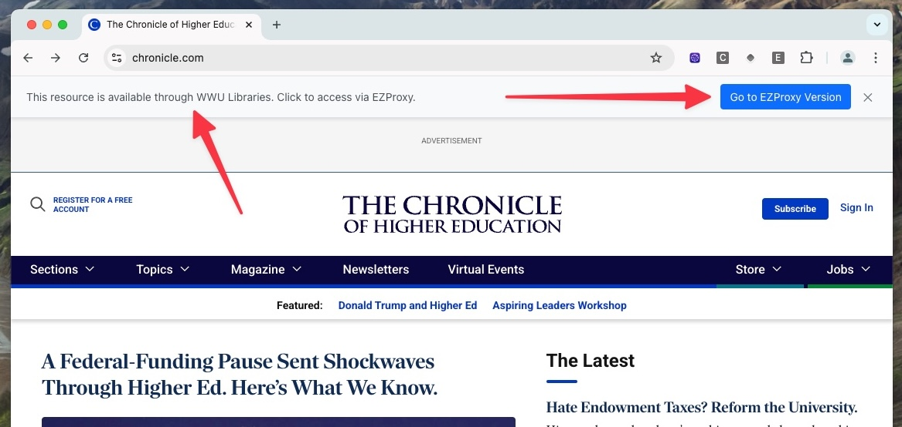
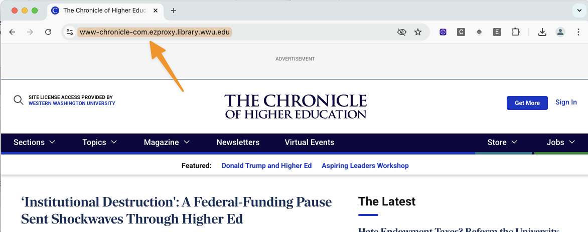

## EZproxy Domain Checker for Western Washington University

### What it does 
This Chrome browser extension makes it easy to access Library resources when the user is off-campus by checking the current domain against a list of EZproxy domains.

If the user is on a website that the Library has access to, the extension will offer to redirect them to the EZproxy version of the site, which allows them to authenticate using their library account.

Here is what it looks like before:

and after the user clicks the button:

